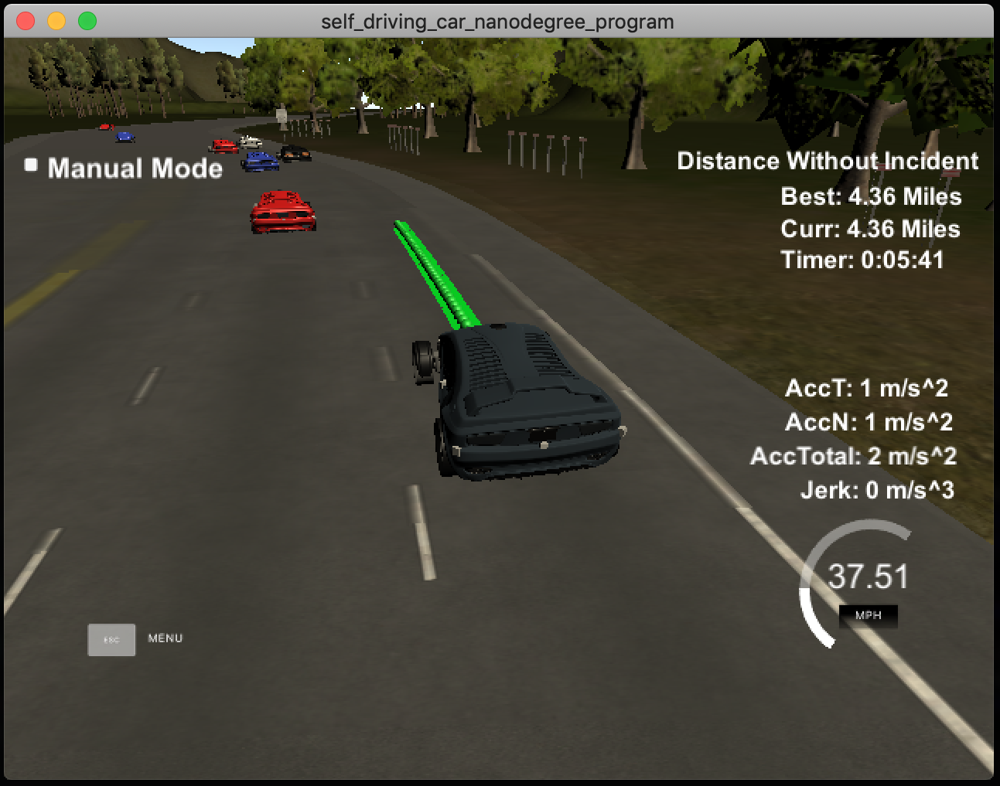
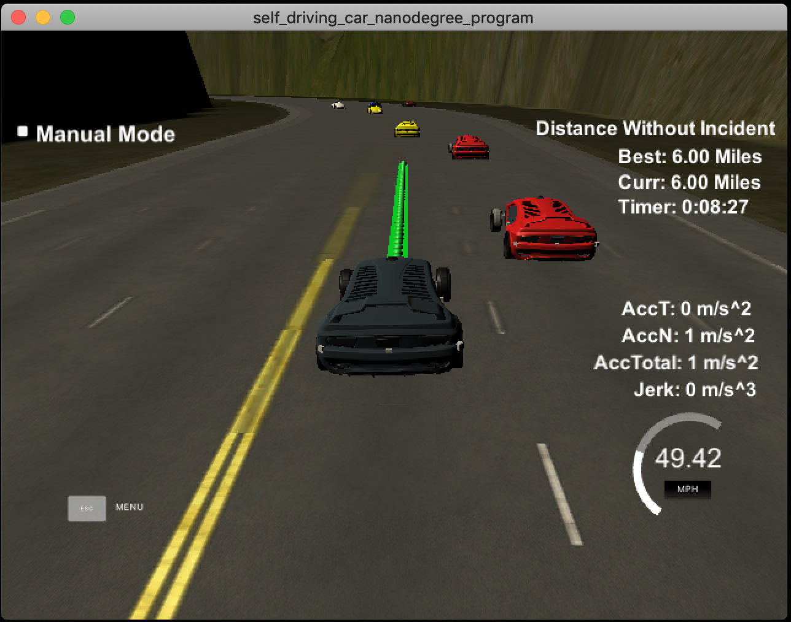
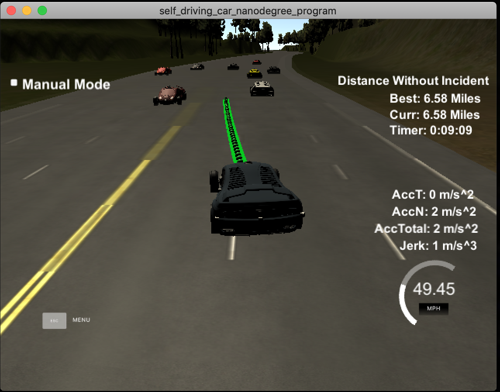

# Path Planning

# [Rubric](https://review.udacity.com/#!/rubrics/1020/view) points

## Compilation

### The code compiles correctly.

No changes were made in the cmake configuration. A new file was added [src/spline.h](./scr/spline.h). It is the [Cubic Spline interpolation implementation](http://kluge.in-chemnitz.de/opensource/spline/): a single .h file you can use splines instead of polynomials. It was a great suggestion from the classroom QA video. It works great.

## Valid trajectories

### The car is able to drive at least 4.32 miles without incident.

### The car drives according to the speed limit.
No speed limit red message was seen.

### Max Acceleration and Jerk are not Exceeded.
Max jerk red message was not seen.

### Car does not have collisions.
No collisions.

### The car stays in its lane, except for the time between changing lanes.
The car stays in its lane most of the time except when it changes lane because of traffic.

### The car is able to change lanes
The car change lanes when the there is a slow car in front of it, and it is safe to change lanes (no other cars around).

## Reflection

#### The code has three parts to it.
1. Determine other cars around the self driving car.
2. Plan lane changes.
3. Generate a trajectory for the path.

### Determine other cars around the self driving car
- This happens from [line 114 to 149](./src/main.cpp#L114-L149)
- Looking at the `sensor_fusion` data and determine a car that's ahead in the same lane, a car that's on the left lane and a car on the right lane.
- For the cars on the lanes other than the self driving car, we don't care if it's ahead or behind the self driving car.
- To do a lane change safely, we need room behind and in front of the car and hence we only see if the other car in the lane will collide with the self driving car.
- It's also possible that there's a car in the adjacent lane but it isn't in colliding distance with the self driving car if we were to change lanes.

### Plan lane changes
- This happens from [line 152 to 185](./src/main.cpp#L152-L185)
- The planning here is simple.
  1. If there's a car ahead, and we're too close to it, see if we can change lanes.
  2. If there's no car in the lane we want to switch to, or if the car isn't within colliding distance, it's safe to change lanes.
  3. If we can't change lanes, reduce speed and try to keep up with the car ahead.
  4. If there's no car ahead of us, increase speed to keep up with the speed limit.

### Generate a trajectory for the path
- This happens from [line 191 - 315](./src/main.cpp#L191-L315)
- To generate the trajectory, we first generate anchor points and fit a spline to these anchor points.
- To keep the trajectory of the car smooth we reuse all the remaining points generated in the previous run.
- New points are appended to the list of previous points using the spline.
- This way there aren't any sudden jerky movements and the car drives smoothly.
